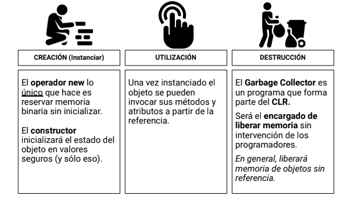
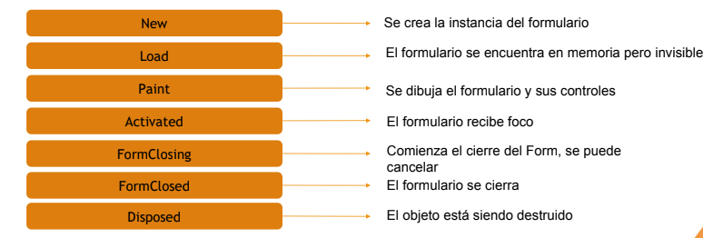

# Programacion
## Resumen programacion 
### Primer Parcial
####  Temas
1. [Introduccion a .Net y C#.](#clase01)
2. [Clases y metodos estaticos](#clase02)
3. [Programacion orientada a objetos.](#clase03)
4. [Sobrecargas.](#clase04)
5. [Windows forms. ](#clase05)
6. [Colecciones.](#clase06)
7. [Encapsulamiento.](#clase07)
8. [Herencia.](#clase08)
9. [Polimorfismo y clases abstractas.](#clase09)

 
 #### 1. Introduccion a .Net y C# 
 ##### .NET
 
 Que es?

 Es una plataforma gratuita de codigo abierto que nos provee herramietas y programas para construir software, asi como tambien el entorno para ejecutarlo.

 Existen 4 implementaciones distintas

- NET Framewoerk
- NET Core
- Xamarin
- NET 5

######CLR (Common Language Runtime) 

Es el encargado de administrar la ejecucion del programa. Todos los programas creados en .NET se ejecutan en un runtime.

######Tareas 
- Administrar uso, asignacion y liberacion de memoria.
- Genera y compila codigo para que el programa pueda ejecutarse
- Manejo de errores en tiempo de ejecucion
- Provee funcionalidades para lenguajes orientados a objetos.
- Soporte para programacion multi-thread.
- Cuestiones de seguridad y rendimiento.
  
######BCL (Base class library)

- Serie de bibliotecas con funcionalidades de uso general que forma parte de los espacios (namespaces) de nombre Microsoft y System.
  
###### Diferencia entre Librerias y Frameworks.

| Librerias | Frameworks |
| -- | -- |
| - Serie de funcionalidades para realizar operaciones especificas, bien definidas. | - Define una forma de trabajo y nos brinda un conjunto de herramientas de alto nivel que nos permite desarrollar ciertas funcionalidades. |
| -Se componen de una coleccion de funciones y objetos auxiliares.  | - Se componen de multiples bibliotecas y otras herramientas. |
| - Nosotros invocamos las funciones de la biblioteca a necesidad.| - El framework invoca al codigo y maneja el flujo de ejecucion. |
| - Nosotros tenemos libertad y control para usar la biblioteca deseada. | - Tiene un comportamiento por defecto y define un estandar para el desarrollador.|

######Proceso de compilacion en .NET

- Todos los lenguajes de .NET siguen el mismo proceso de compilacion.

- El proceso de compilacion pasa por 3 estados y se divide en dos etapas.
  

1. Primera etapa (Static Compilation):
El codigo fuente (Sourse code) de los programas de .NET pueden estar escritos con cualquiera de los lenguajes que seoporta la plataforma ( C#, F#, VB .NET ). Cada uno tiene su propio compilador (el de c# se conoce como **Roslyn** ).
El compilador se encarga de traducir el codigo fuente a ensamblador.

2. Segunda parte (Just in time.):
    Luego el CLR compila el lenguaje intermedio a lenguaje nativo (maquina) en un proceso llamado compilacion just in time.
    Este tipo de compilación tiene como beneficio que abstrae al código fuente de la máquina y el sistema operativo sobre el que se terminará ejecutando el programa, el dependiente es el compilador JIT y el entorno de ejecución. Como desventaja, la compilación JIT realentiza la ejecución del programa ya que se debe esperar a que se compile el lenguaje intermedio.

###### Tiempo de ejecucion y tiempo de compilacion.

- Tiempo de compilacion
  : Es el intervalo de tiempo en el que un compilador compila codigo escrito en un lenguaje de programacionn a una forma de codigo ejecutable por una maquina.
  (Normalmente realiza un checkeo de sintaxis y optimiza el codigo.)
- Tiempo de ejecucion
    : Es el intervalo de tiempo en el que un programa se ejecuta, inicia cuando el programa se pone en memoria y finaliza cuando se envia una señal de terminacion.

##### C# 
###### Caracteristicas de C#.
 *En c# el entry point o punto de entrada es el metodo main.*
 - Compilacion hibrida.
   : C# se compila primero a un lenguaje intermedio y luego al ejecutarse es recompilado a lenguaje nativo/maquina.

 - Orientado a objetos.
    : El lenguaje ofrece caracteristicas orientadas a objetos  como soporte de herencia, encapsulamiento y polimorfismo.
  
 - Orientado a componentes.
    : Tambien presenta caracteristicas que permiten el desarrollo basado en componentes.

 - Seguridad de tipos.
     : Es un lenguaje principalmente de tipado estatico.
 - Garbarage colector.
    : Tiene un programa que se encarga de la liberacion de memoria no utilizada en el heap.

 - Sistema  de tipos unificados.
      : **TODOS** los tipos de datos heredan del tipo object. 

 - Case sensitive.
    : C# es un lenguaje que distingue mayusculas de minusculas.
###### Gramatica de C#.

- Sintaxis: 
  : Serie de reglas que define las combinacoines correctas de simbolos y orden para formar sentencias.
- Vocabulario:
    : Serie de palabras reservadas y operadores que sirven para construir sentencias y expreciones siguiendo reglas de sintaxis.
- Semantica:
   : Es el significado de surge de la combinacoin de esas sentencias y expreciones con una sintaxis valida.
 
##### Common type sistem (CTS)
 El CTS define un conjunto de tipos de datos comun a todos los lenguajes por .NET.
- Establece un marco de herramientas que habilita la ejecucion de los distintos lenguajes de la plataforma.
- Provee el modelo orientado a objetos.
- Define el conjunto de reglas que todos los lenguajes deben seguir en lo que refiere a tipos.
- Provee una biblioteca que contiene los datos primitivos.
- Define tipos de datos en dos categorias: 
    - Valor: 
        :   (value type) Tipos de datos representados por su valor real. (*TODOS los tipos de valor se almacenan en el stack*)
    - Referencia:
        : (Reference types) Son tipos de datos representados por una referencia que apunta a un sector de memoria donde se encuentra el valor real.(*TODOS los tipos de referencia se almacenan en el monton*) 
        
######Categoria de tipos.
|Categoria|Palabra clave|Valor/Referencia|
|--|--|--|
|Clases|class|Referencia|
|Estructura|struct|Valor|
|Enumerado|enum|Valor|
|Interfaces|interface|Referencia|
|Delegado|delegate|Referencia|

######Conversiones de tipos de datos.
- Implicitas
    : No requiere casteo, NO deberia implicar perdida de datos.
- Explicitas
    : se requiere casteo , PODRIAN implicar perdida de datos.
 ___

###Clase 02.
####Principio DRY (Dont repeat yourself).
> "Toda **pieza de conocimiento** debe tener una representación **única**, **inequívoca** y **fidedigna** dentro de un sistema."

- Pieza de conocimiento:
    : Refiere a una funcionalidad precisa dentro del contexto de negocio o un algoritmo concreto.
- unica: 
    : Que no debe existir otra representacion de la misma pieza.
- Inequivoca:
    : Que no admite de una interpretacion.
- Fidedigna: 
    : Debemos poder confiar que es correcta.

La idea principal es que cuando ocurra un cambio no deberiamos necesitar actualizar multiples cosas en paralelo.

#### Clases y metodos estaticos
##### Metodos estaticos.
*Pequeñas piezas de codigo que se encargan de realizar una tarea concreta.* 
###### Firma.

~~~
(Modificador de acceso) (Otros modificadores) (Tipo de retorno) (Nmbre identificador) (Parametros de entrada)
~~~

~~~
Private static string Mostrar(primerParametro , segundo parametro)
{

}
~~~
#####Clases estaticas.
Son agrupadores de atributos y metodos estaticos.
*Para declarar una clase se debe indicar*
~~~
(Modificador de visibilidad (puede ser internal o public)) static class (Nombre de la clase)
~~~
######Caracteristicas
- NO pueden ser clase base.
- NO pueden ser clase derivada.
- NO se pueden instanciar. 
- TODOS los miembros son estaticos.
  
#### Namespaces.

*Agrupacion logica de clases y otros elementos de codigo fuente.
Su funcion principal es organizar el codigo, permitiendo la reduccion de los conflictos por nombres duplicados y la posibilidad de trabajar en un mismo programa con componentes de distinta procedencia.*

##### Using
Permite la especificacion de una llamada a un metodo sin el uso obligatorio del nombre completo.

#####Alias
Permite utilizar un nombre distinto para un espacio de nombre. (Se suele utilizar para abreviar nombre largos).
___

###Clase 03.
####Paradigma.

*Un paradigma es una teoria o conjunto de teorias cuyo nucleo central se acepta sin cuestionar y que suministra la base y modelo para resolver problemas y avanzar en el conocimiento.*

#####Paradigma de programacion.
*Define la forma, metodologia o estilo con el que se resolvera un problema utilizando un lenguaje de programacion*

- **Paradigma imperativo**: En el cual el programador instruye a la maquina como cambiar su estado.
  - **Pardigma procedural**: Separa las instrucciones en    procedimientos.
  - **Paradigma orientado a objetos**: Agrupa estas instrucciones junto al resultado sobre el que esperan.
-  **Paradigma declarativo**: En el que el programador solamente declara propiedades de un resultado deseado, pero no indica como calcularlo.
    - **Paradigma funcional** donde el resultado deseado es declarado como el valor de una serie de aplicaciones de función.
    - **Paradigma lógico** donde el resultado deseado se declara como la respuesta a una pregunta sobre un sistema de hechos y reglas.
    - **Paradigma matemático** donde el resultado deseado se declara como la solución de un problema de optimización.
    - **Paradigma reactivo** donde el resultado deseado se declara con flujos de datos y la propagación del cambio.

####Programacion orientada a objetos.

*La programacion orientada a objetos es un paradigma que propone resolver problemas a traves de identificar objetos de la vida real, sus atributos, sus comportamientos y las relaciones de colaboracion entre ellos.*

#####Pilares de la programacion orientada a objetos.
- **Abstraccion**
    : Se trata de Capturar la idea principal de un objeto dentro de un determinado contexto, ignorando detalles o especificaciones que no sean relevantes.
    : Ejemplo: en una persona podemos fijarnos solamente en una parte que nos importe por ejemplo podemos mirar la cabeza ignorando el resto del cuerpo.
- **Encapsulamiento**
    : Agrupa datos y acciones relacionados a un objeto ocultando los detalles y protegiendo el acceso a los datsos.
    : Ejemplo: En una persona la piel nos oculta todo lo de dentro, nosotros no vemos como respiramos o como se digiere la comida.
- **Herencia**
    : Se trata de reutilizar codigo partiendo de una clase mas general (padre o base) que compartira su estructura y funcionalidad a las clases mas especificas.
    : Ejemplo en una empresa Todos son personas pero tienen distintas cualidades o hacen distintas cosas por ejemplo un jefe no tiene las mismas actividades que una persona de limpieza o capaz un pasante no tiene sueldo.
- **Polirmorfismo**
    : Se trata de que una clase hija o derivada pueda redefinir una determinada accion heredada de una clase padre o base.
    : ejemplo una persona puede ser de distintos tipos o ir cambiando de clase.
#### Clases.
*Es una descripcion de un conjunto de objetos que comparten los mismos metodos, atributos, relaciones y semantica en un determinado contexto.*
##### Como se compone una clase?
-  Atributos
    : Representacion de caracteristicas que son compartidas por todos los objetos de una clase.
- Metodos
    : Es la implementacion de una operacion qye es una abstraccion de algo que puede hacer un objeto.
- Constructores
    : Metodo especial cuya funcion es darle valor inicial a los atributos de un objeto.
  - Constructor estatico:
        : Son invocados por el entorno de ejecucion (CLR) una sola vez.
    - No pueden ser invocados.
    - No tienen modificadores de acceso.
    - No tienen parametros de entrada.
    - No pueden ser sobrecargados.
    - Solamente permiten trabajar con miembros que tambien son estaticos.

#### Objeto.

*Son instancias de una clase.*

Instancia 
    : manifestacion concreta de algo. 

Para instanciar un objeto se utiliza el operador **new**.

#####Caracteristicas.

- Viven en memoria (sector heap).
- Tienen identidad. 
   : propiedad que permite diferenciarlos entre si.

##### Destruccion de un objeto.
- No esta vinculado a su ambito.
- Tiene un tiempo de vida mas largo.
- Destruccion no determinista.

##### Ciclo de vida de un objeto.
 

###Sobrecargas.
La sobrecarga es una tecnica para mejorar la usabilidad, productividad y la legibilidad de nuestro codigo.
Permite declarar miembros con el mismo nombre en la misma clase siempre que tengan distinto orden, cantidad o tipo de parametros.

*Se revisan en tiempo de compilacion.*

####Sobrecarga de metodos.

Se utiliza para crear varios metodos con el mismo nombre 
que realicen la misma accion o similares pero con distintos argumentos.

####Sobrecarga de constructores.

Para sobrecargar a los constructores, sólo hay que proporcionar varias declaraciones del constructor con distintas firmas.
El encabezado del constructor seguido de un signo de dos puntos( : ) y de la palabra clave this, se utiliza para invocar a otro constructor.

####Sobrecarga de operadores.
Una clase puede tener su propia sobrecarga de operadores.

#####Operadores unitarios sobrecargables.
---

\+   \-   !   ~   ++   --   true   false 

---

##### Operadores binarios sobrecargables.

---

 \+    \-   *   /   %   &   |   ^   <<   >>   ==   !=   >   <    >=   <=

---
##### Operadores NO sobrecargables.

---

=, &&, ||, ??, ?:, =>, checked, unchecked, new, typeof, default, as, is
 
---

####Sobrecarga de operadores de convercion.

Se puede definir una convercion explicita o implicita personalizada desde o hacia otro tipo.

- Conversion implicita
    : no requieren intervencion del programador, no hay perdida de datos.
- Conversion explicita
    : Requieren intervencion del programador,puede haber perdida de datos.

### Clase 05.

### Windows forms.
*Es una libreria de clases que provee una GUI por el mismo sistema de .NET*
***TODOS** los formularios heredan de la clase FORM*
*Para abrir un form en tipo modal se usa .ShowDialg(), para abirlo normal se usa .Show()*
#### Clases Parciales.
Una clase parcial es una clase que esta dividida en dos archivos.
*En forms permite separar el codigo autogenerado por el diseñador de la logica de nuestra aplicacion.*

####Ciclo de vida de un form.

1. new: se crea la instancia del form.
2. Load: El form se encuentra en memoria pero invisible.
3. Paint: Se dibuja el form y sus controles.
4. Activated: El form recibe foco.
5. FormClosing: Comienza el cierre del from, se puede cancelar.
6. FormClosed: el formulario se cierra.
7. Disposed: El objeto esta siendo destruido.
   
####Propiedades.

Nos permite modificar valores de nuestros atributos o acceder a ellos.

####Controles.
Componentes reutilizables que encapsulan funcionalidad de una interfaz grafica.

<a name ="clase06">
<a name ="clase07">
<a name ="clase08">
<a name ="clase09">
 

